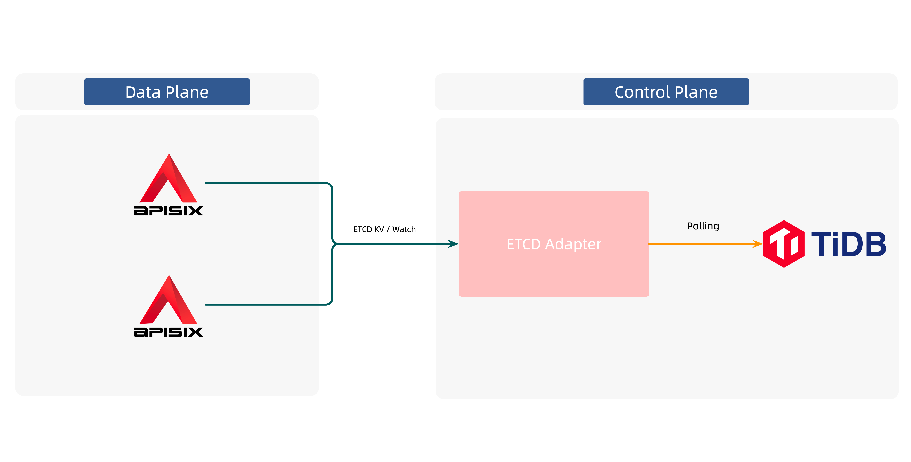

# 使用 TiDB 作为 Apache APISIX 的配置中心您

## 作者信息

| 姓名      | GitHub Link |
| ----------- | ----------- |
| 张超 | https://github.com/tokers |
| 屠正松 | https://github.com/tzssangglass |
| 白泽平 | https://github.com/bzp2010 |
| 陈婧晗 | https://github.com/Sindweller |

## 项目进展

To be continued.

## 项目介绍

TiDB 是一款开源的云原生分布式 SQL 数据库，本项目将致力于使用 TiDB 作为 [Apache APISIX](https://en.pingcap.com/) 的配置中心，使得用户可以使用 [TiDB](https://en.pingcap.com/) 作为 APISIX 的配置中心。

## 背景 & 动机

Apache APISIX 是一款云原生的 API 网关，其使用 [ETCD](https://etcd.io/) 作为原生的配置中心，从而动态地获取配置变更。而因为历史原因或者技术选型的缘故，一些用户或者组织可能无法选择使用 ETCD 集群，届时如果想使用 Apache APISIX 则会比较棘手。

因此我们希望可以为 Apache APISIX 引入更多的配置中心方案，从而给用户开放更多的选择，而不必被 ETCD 所绑定。我们知道 TiDB 是一款优秀的开源的云原生分布式 SQL 数据库，而且兼容 MySQL 协议。因此我们希望能够把 TiDB 作为 Apache APISIX 的配置中心，同时丰富这两款开源软件的生态。

## 项目设计

整个项目的设计大约可以分为如下两步：

1. 决定 TiDB 和 Apache APISIX 的集成方式
2. 设计 TiDB 中 Apache APISIX 的数据保存格式；

我们将依次介绍其设计。

### TiDB 和 Apache APISIX 如何集成

我们可以想到的最直观的方案是，扩展 Apache APISIX 的核心功能，使其支持 MySQL 协议，从而可以和 TiDB 进行完成通信，然而，这种方案存在一些缺点：

1. 改造 Apache APISIX 的成本过大。

Apache APISIX 的核心代码中（指配置获取部分），与 ETCD 存在不少的耦合，甚至对上层暴露的数据格式也存在 ETCD 的影子，而且由于其核心代码是用 [Lua](https://www.lua.org/) 语言所写，相对比较小众，其开发者较少，即便出现问题，可获取到的社区的支持也比较有限。因此直接改造带来的成本是比较大的；

2. 配置的实时推送问题

Apache APISIX 之所以选择 ETCD 作为其原生配置中心，除了考虑到 ETCD 的生态优势以外，也看中了它的 [Watch](https://etcd.io/docs/v3.2/learning/api/#watch-api) 能力，因此配置变更延时可以控制在毫秒级别。而这也正是关系性数据库所没有的能力，因此这一方面的能力需要自研，这会极大地增加 Apache APISIX 核心代码的复杂性，与 Apache APISIX 向来推崇的「极简的核心逻辑」是相悖的。

鉴于上述的问题，我们没有选择这一方案。

计算机科学领域存在一句名言，任何一个问题都可以通过引入额外的一个间接层来解决。在考虑引入中间层后，我们得到了另外一个方案，不改造 Apache APISIX，开发一个中间件，该中间件暴露标准的 ETCD API 服务；同时对接 TiDB，从而将「TiDB 作为实际的配置中心」这一事实隐藏起来，从 Apache APISIX 的视角来看，它还是在和 ETCD 交互。

因此，问题就变成了，我们该如何开发这一中间件，我们将问题进行梳理后，明确了该中间件需要有的功能：

1. 实现 ETCD API，主要包括 KV 和 Watch APIs；
2. 对接 TiDB，定期轮询数据库获取到配置变更；

由于配置变更不在 Apache APISIX 这一侧，我们没有了编程语言的限制，因此我们考虑使用主流的 [Go](https://go.dev/) 语言进行开发（TiDB 本身也使用了 Go 语言）因此功能 2 的实现难度较低，我们也可以得到来自 Go 和 TiDB 两个社区的支持。

而对于第一项功能，对其进行拆分后可以了解到，它所做的是一个 ETCD 适配器，我们需要去使用 ETCD 主仓库提供的 ETCD API 桩代码，实现一个 gRPC 服务，同时自定义其数据来源（TiDB）。

事实上，早在 2021 年年中，Apache APISIX 社区就有了类似的方案来扩展配置中心，[API7.ai](https://www.apiseven.com/en) 开源了一个项目 [api7/etcd-adapter](https://github.com/api7/etcd-adapter)，就实现了对应的功能。因此我们可以「站在巨人的肩膀上」进行开发贡献。

在确定该方案确定可行后，我们明确了 Apache APISIX 和 TiDB 的交互方式，其架构图如下：

